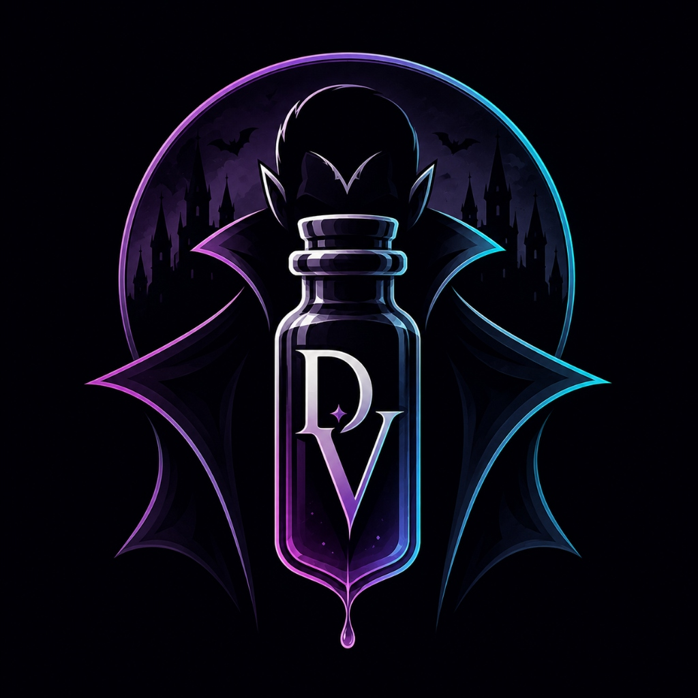
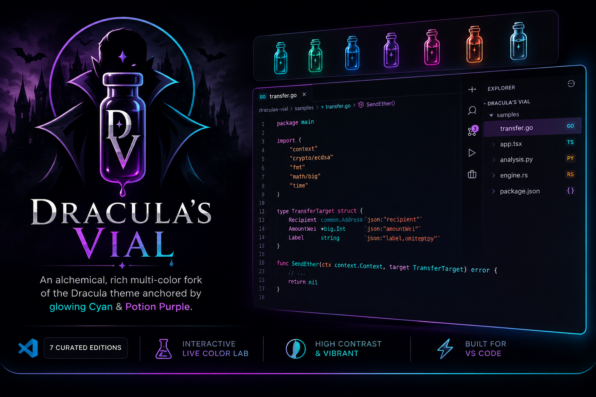
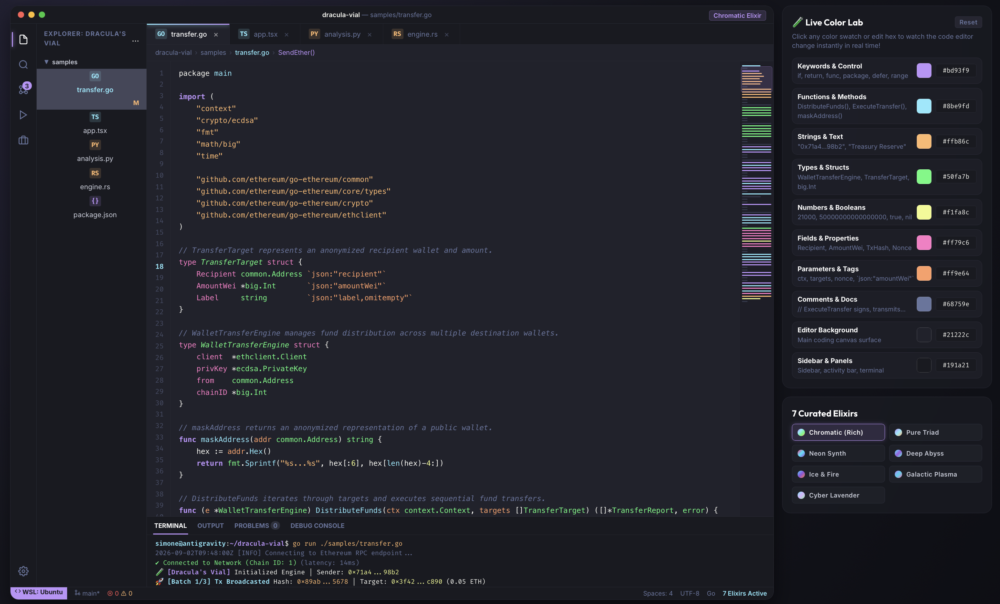
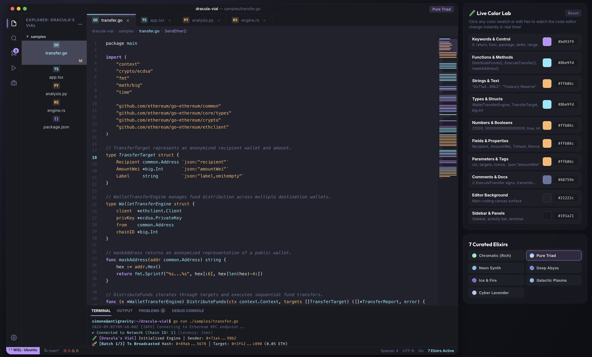
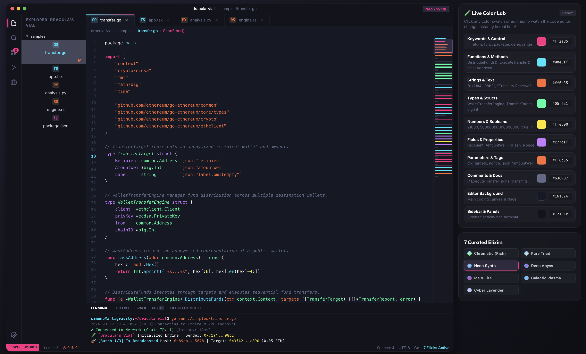
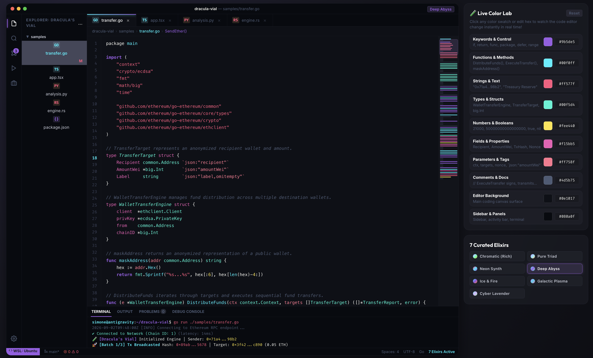
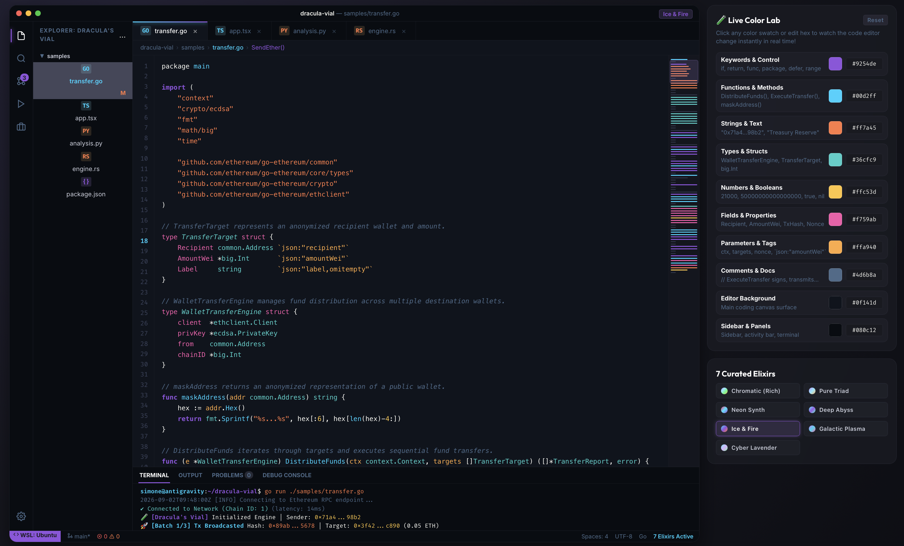
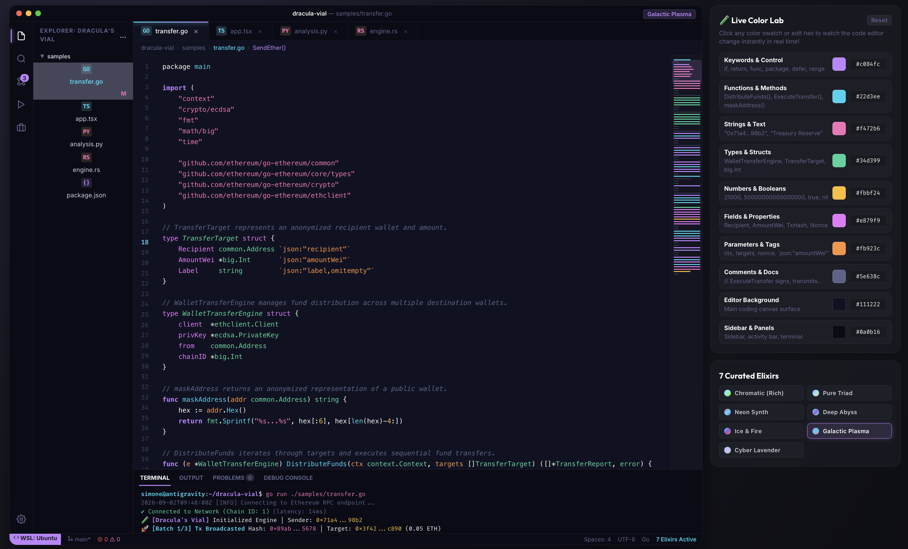
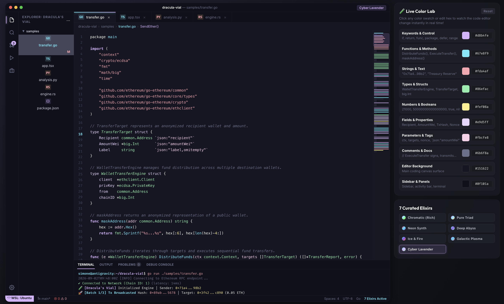

<p align="center">
  
</p>

<h1 align="center">🧪 Dracula's Vial</h1>

<p align="center">
  <b>An alchemical, rich multi-color fork of the Dracula theme anchored by glowing Cyan & Potion Purple.</b><br>
  Features 7 curated high-contrast VS Code editions with an interactive live Color Lab studio.
</p>

<p align="center">
  <a href="https://marketplace.visualstudio.com/"></a>
  <a href="https://github.com/sevnth/draculas-vial"></a>
  <a href="LICENSE"></a>
  <a href="https://draculatheme.com"></a>
</p>

---

<p align="center">
  
</p>

---

## 🎨 The 7 Curated Elixir Editions (Full Showcase)

---

### 1. 🧪 Dracula's Vial - Chromatic (Rich Full-Spectrum)
> **Maximum Color Richness**: Expands token definitions so every semantic element (functions, types, keywords, strings, tags, numbers, properties) stands out with high distinction.

<p align="center">
  
</p>

- **Keywords / Control:** `#bd93f9` (Purple)
- **Functions & Methods:** `#8be9fd` (Cyan)
- **Strings & Text:** `#ffb86c` (Orange)
- **Types & Structs:** `#50fa7b` (Green)
- **Numbers & Constants:** `#f1fa8c` (Yellow)
- **Fields & Properties:** `#ff79c6` (Pink)
- **Parameters & Tags:** `#ff9e64` (Tangerine)

---

### 2. ⚡ Dracula's Vial - Pure Triad (Cyan • Purple • Orange)
> **Distraction-Free Minimal Triad**: An intentional 3-accent color scheme focused purely on the core triad (Purple keywords, Cyan functions/types, Orange strings/constants).

<p align="center">
  
</p>

- **Keywords / Control:** `#bd93f9` (Purple)
- **Functions & Types:** `#8be9fd` (Cyan)
- **Strings & Numbers:** `#ffb86c` (Orange)

---

### 3. 🌆 Dracula's Vial - Neon Synth (Hot Pink • Cyan • Violet)
> **Cyberpunk Synthwave Glow**: Electric high-contrast colors on a deep obsidian canvas designed for night coding sessions.

<p align="center">
  
</p>

- **Keywords:** `#ff2a85` (Hot Pink)
- **Functions:** `#00e5ff` (Electric Cyan)
- **Strings:** `#ff6b35` (Sunset Orange)
- **Types:** `#05ffa1` (Emerald)
- **Numbers:** `#ffe600` (Canary Yellow)
- **Canvas Background:** `#161824`

---

### 4. 🌊 Dracula's Vial - Deep Abyss (Oceanic Bioluminescence)
> **Deep Oceanic Trench**: Bioluminescent glowing cyan and coral highlights against an ultra-dark oceanic canvas.

<p align="center">
  
</p>

- **Functions & Accents:** `#00f0ff` (Bioluminescent Cyan)
- **Keywords:** `#9b5de5` (Phantom Purple)
- **Types:** `#00f5d4` (Seafoam Green)
- **Strings:** `#ff577f` (Coral Pink)
- **Canvas Background:** `#0e1017`

---

### 5. ❄️ Dracula's Vial - Ice & Fire (Glacial Cyan & Purple Flame)
> **Cryogenic Contrast**: Sharp contrast between ice-cold glacial cyan and searing purple/orange flame accents.

<p align="center">
  
</p>

- **Keywords:** `#9254de` (Violet Flare)
- **Functions:** `#00d2ff` (Glacial Cyan)
- **Strings:** `#ff7a45` (Dragon Orange)
- **Types:** `#36cfc9` (Frost Mint)
- **Canvas Background:** `#0f141d`

---

### 6. ☄️ Dracula's Vial - Galactic Plasma (Plasma Violet & Solar)
> **Cosmic Plasma**: Interstellar energy with vibrant plasma purple, ion cyan, radiant pink, and solar amber.

<p align="center">
  
</p>

- **Keywords:** `#c084fc` (Plasma Purple)
- **Functions:** `#22d3ee` (Ion Cyan)
- **Strings:** `#f472b6` (Cosmic Pink)
- **Types:** `#34d399` (Emerald Light)
- **Numbers:** `#fbbf24` (Solar Amber)
- **Canvas Background:** `#111222`

---

### 7. 🪻 Dracula's Vial - Cyber Lavender (Pastel Cyber)
> **Ultra-Soft Pastel Cyber**: Designed specifically for long hours of coding with zero visual fatigue.

<p align="center">
  
</p>

- **Keywords:** `#d8b4fe` (Pastel Lavender)
- **Functions:** `#67e8f9` (Soft Cyan)
- **Strings:** `#fda4af` (Pastel Peach)
- **Types:** `#86efac` (Mint Green)
- **Numbers:** `#fef08a` (Butter Yellow)
- **Canvas Background:** `#151622`

---

## 🧪 Live Interactive Color Lab (`preview/index.html`)

An interactive web studio is included directly in `preview/index.html`:
- **Real-Time Color Pickers**: Customize color swatches or hex inputs and watch code highlight dynamically.
- **Preset Switcher**: Switch instantly between all 7 curated editions.
- **Suggest Color Scheme**: Generates and copies a markdown snippet with all your custom colors so you can paste it directly into chat!
- **Multi-Language Sandbox**: Real-world samples in **Go** (Ethereum EIP-1559 transfer), **TypeScript/React**, **Python**, **Rust**, and **JSON**.

---

## 📦 Installation & Activation

### Option 1: Local Installation (PowerShell)
```powershell
# Copy the extension to your VS Code extensions directory
Copy-Item -Recurse "C:\Users\sevnth\draculas-vial" "$HOME\.vscode\extensions\draculas-vial"
```

### Option 2: Publishing to VS Code Marketplace
1. Install the VS Code Extension manager:
   ```bash
   npm install -g @vscode/vsce
   ```
2. Package the extension:
   ```bash
   vsce package
   ```
3. Publish to the Marketplace:
   ```bash
   vsce publish
   ```

### Activating the Theme in VS Code
1. Press `Ctrl + K` then `Ctrl + T`.
2. Select any of the 7 **Dracula's Vial** editions!

---

## 📄 License
[MIT License](LICENSE) © 2026 Sevnth
